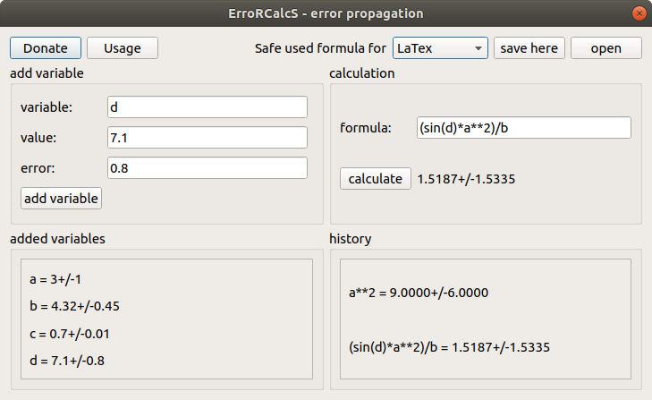

"ErroRCalcS" is a GUI-tool to calculate uncertainties by using the uncertainties and the PyQt5 packages.

## update 0.3.0
In version 0.3.0 there are some new features:

* you can chose now where to save the formula file via the 'save here'-button
* you can open the file directly by clicking 'open'
* the Program checks the internetconnection in order to chose from where to open the usage.md
* completely new structure: some functions have been moved from GUI. py and calc. py to a new script (add. py) to make the program code easier to read.

Furthermore some bugs were fixed.

## Usage / funktion
The aplication starts with a window with different input fields (see picture below):

- variable (name of variable, e.g. d)
- value (Value of variable e.g. 7.1)
- error (correspondending error on the variable, e.g. 0.8 or 0,8)
- formula (desired formula, using the variables and further values and arithmetic characters

By clicking on the 'add-variable' button, the entries are written to files in a folder named '.\_\_log\_\_'. By clicking on the 'calculation' button, the formula entry is also written to a file in the '.\_\_log\_\_' and 'calc.py' starts running, and writes the calculation and the result in files into the '.\_\_log\_\_'.
Variables can be overwritten.

By selecting a format behind 'Safe used Formula for' the used formula for error propagation is written into a file named 'saved_formula.txt' in the current directory. By clicking the 'save-here'-button you can chose, where to save the used formula. Clicking the 'open'-button leads directly to the file where the formula was saved in.

If LaTex is selected, the formula is also written to the .txt file. You can copy this into a .tex document. If you import there the 'amsmath' module (\usepackage{amsmath}), you can use this formula without editing.

## Input and Result Examples

### General Inpus
| variable | value | error | formula | result |
| ------ | ------ | ------ | ------ | ------ |
| V, T, n | 2, 283.5, 4.3 | 0, 0.5, 0.03 | (n\*8.314\*T)/V | 5067.591+/-36.467 |
| x | 4.3 | 1.1 | sin(x)*3.5 | -3.2066+/-1.5431 |
| y | 3.254 | 0.032 | log10(y) | 0.5124175+/-0,0042709 |
| x, y | 4.3, 3.254 | 1.1, 0.032 | log(x)\*\*y | 3.4156+/-1.9497 |

### Arithmetic Characters
| characters and operators | meaning |  example |
| ----- | ----- | ----- |
| + | plus | 4+2=6 |
| - | minus | 4-2=2 |
| \* | multiplication | 4\*2=8 |
| / | division | 4/2=2 |
| \*\* | exponent | 4\*\*2=16 |
| sqrt(x) | square root | sqrt(4)=2 |
| log(x) | natural logarithm | log(2.71828)=1 |
| logY(x) | logarithm with base Y | log10(2.71828)=0.4343 |
| sin(x) | sinus in radian | sin(1)=0.8415 |
| cos(x) | cosinus in radian | cos(1)=0.5403 |
| tan(x) | tangens in radian | tan(1)=1.5574 |
| asin(x) | arcsinus in radian | asin(1)=1.5707 |
| acos(x) | arccosinus in radian | acos(1)=0 |
| atan(x) | arctangens in radian | atan(1)=0.7854 |
| exp(x) | exponentialfunktion of e^(x) | exp(2)=7.3891 |

## Requirements
- Python >= 3.4
- uncertainties
- PyQt5

The executable installation is not available at thi moment!
## Installation
If you just want to use the tool, without editing or something or if you don't want to download all used python modules, you can download the executables listed for the different distributions below.
If you want to modificate the different files, then _clone_ this repository by following command to your computer:
`git clone https://github.com/leonfrcom/ErroRCalcS`
Or you can download a _zip_, which contains only the python scripts [here](https://github.com/leonfrcom/ErroRCalcS/raw/master/executables/ErroRCalcS.zip).

Reminder: The application will build a folder in the same directory where the executable is.

#### Windows
In order to use the application on windows you can download the '_ErroRCalcS.exe_' [here](https://github.com/leonfrcom/ErroRCalcS/raw/master/executables/ErroRCalcS_0.3.0.exe).

#### Linux
For the use of the application on windows you can download the '_ErroRCalcS executable for linux_' [here](https://github.com/leonfrcom/ErroRCalcS/raw/master/executables/ErroRCalcS_0.3.0). This link leads to a download of a single executable file, which is the application. In the most cases you wont be able to run the application until you changed it to _executable_:
You can do this by opening the console in the directory where the downloaded file is and typing the command `chmod +x ErroRCalcS` or you can do this by rightklick on the file -> _Properties_ -> _Permissions_ and mark 'Allow executing file as a program'.

#### MacOS
There is no executable file for MacOS yet! If you want to use _ErroRCalcS_, you have to _clone_ the repository, or if you only want to use the python files, download them [here](https://github.com/leonfrcom/ErroRCalcS/raw/master/executables/ErroRCalcS.zip).
There will be a MacOS executable soon!
